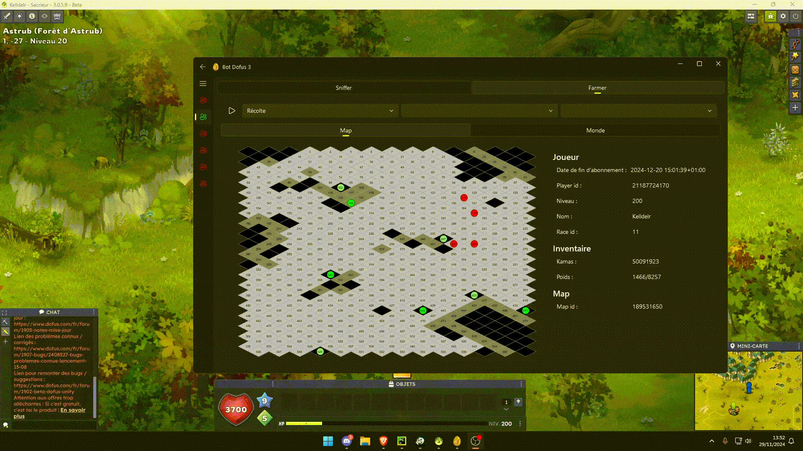
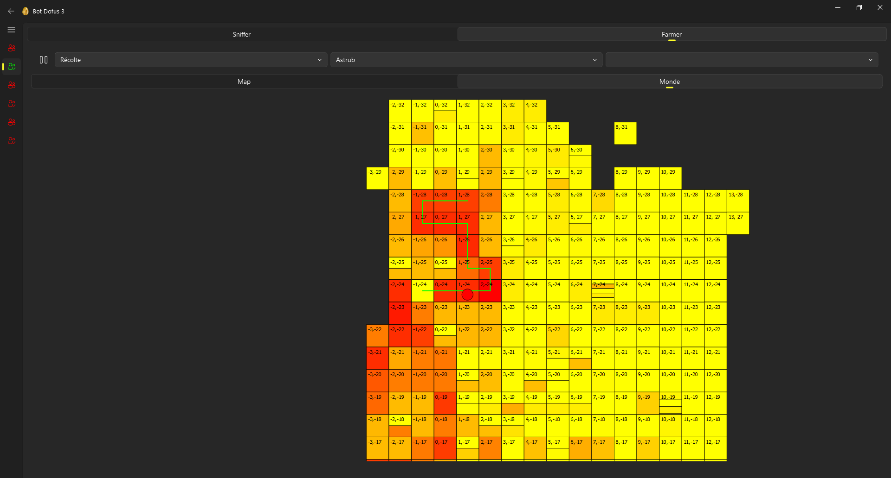
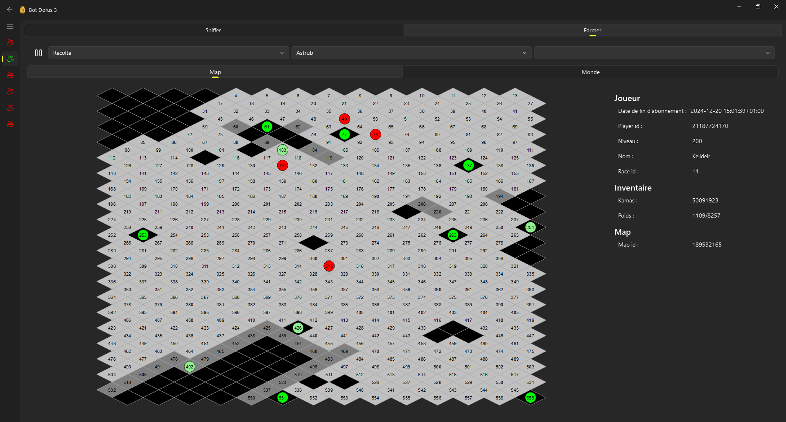
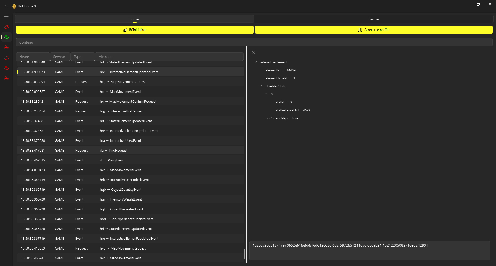

## Mitm

- `poetry run python __main__.py`

Autres :

Profiling :
`poetry run python -m cProfile -o benchmark.pstats __main__.py`
`gprof2dot -f pstats benchmark.pstats | dot -Tpng -o benchmark_output.png`

TODO :

- Gérer la reconnexion quand le perso est en fight
- Fix un max de invalid transition
- Avec le sniffer, capturer ses temps de réaction dans une session de farming et de fight pour les reproduire dans les temps d'attente (avec écart type etc...)
- Faire bdd pour enregistrer a quel point des ressources partent vite et leur prix

PyInstaller -> pyarmor gen -O dist **main**.py && pyinstaller --add-data "D3Database":"D3Database" --add-data "resources":"resources" dist/**main**.py --noconfirm
